# SkillLink GH

A full-stack platform connecting clients with skilled artisans in Ghana.
Built with **Flutter** (mobile), **Spring Boot** (recommendation backend), and **React** (admin panel).

---

## Project Structure

```
skill_link_gh/
├── frontend/        # Flutter mobile app (iOS & Android)
├── backend/         # Spring Boot recommendation engine (Java 17 + PostgreSQL)
└── admin_panel/     # React admin dashboard (TypeScript + shadcn/ui)
```

---

## Tech Stack

| Layer | Technology |
|---|---|
| Mobile | Flutter, Dart, Riverpod, Firebase |
| Backend | Spring Boot 3, Java 17, PostgreSQL, Firebase Admin SDK |
| Admin | React 18, TypeScript, Vite, Tailwind, shadcn/ui |
| Payments | Paystack |
| Auth | Firebase Auth (ID token verification) |
| Storage | Firebase Storage (videos, images) |
| Realtime | Firestore (chat, bookings, live tracking) |

---

## Literature Review — Bibliometric Analysis

### Figure 1.1 — Thematic Summary: Influence of Digital Platforms on Gig Workers

> *Based on systematic review of 18 peer-reviewed articles (2019–2023) using PRISMA framework and thematic analysis. Source: Alauddin et al. [13]*

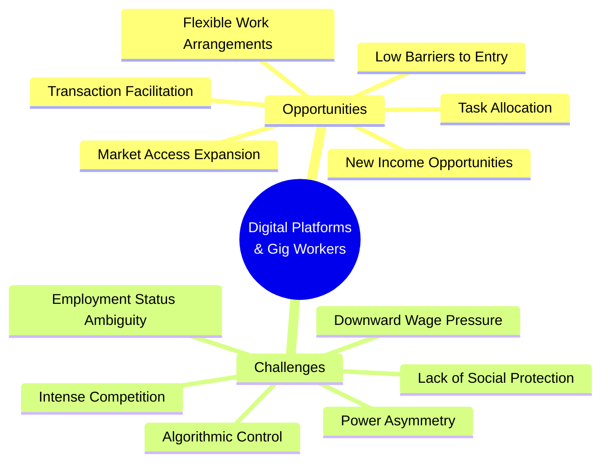

---

### Figure 1.2 — PRISMA Flow Diagram: Article Selection Process

> *Systematic literature review on digital platform influence on gig economy workers. Source: Alauddin et al. [13]*

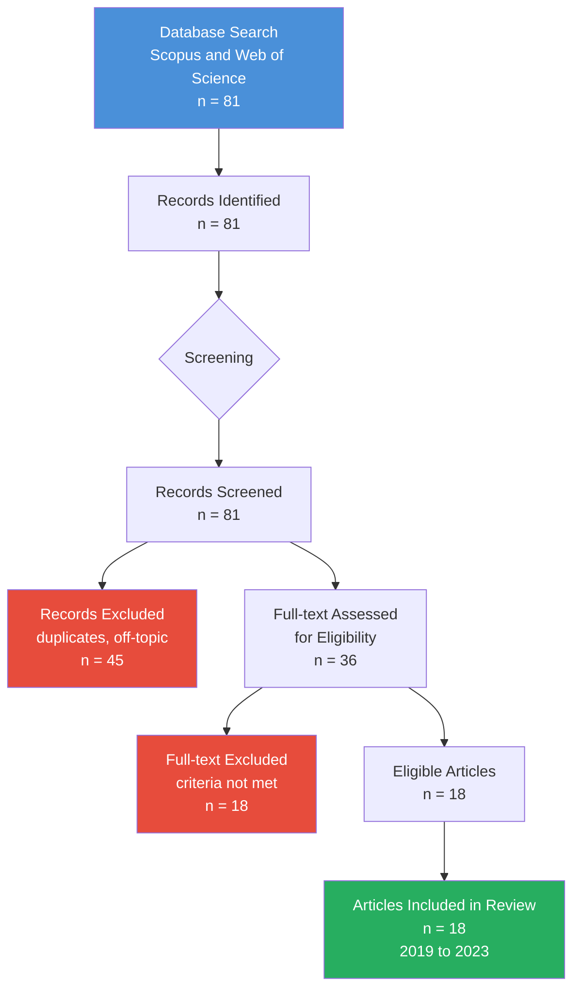

---

### Figure 1.3 — Bibliometric Analysis: Research Coverage of AI & Social Media Platforms

> *Integrative review of 127 scholarly articles (2018–2024) across Web of Science, Scopus, ACM Digital Library, and IEEE Xplore. Source: Leblanc & Roux [14]*

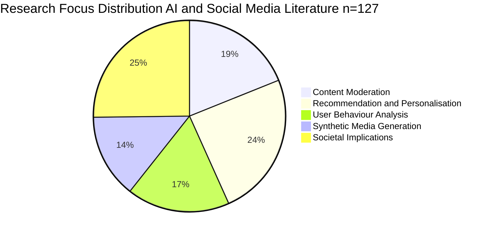

---

### Figure 1.4 — Geographic Distribution of Reviewed Studies

> *Highlights the gap in Global South / African context research, motivating the SkillLink GH design choices.*

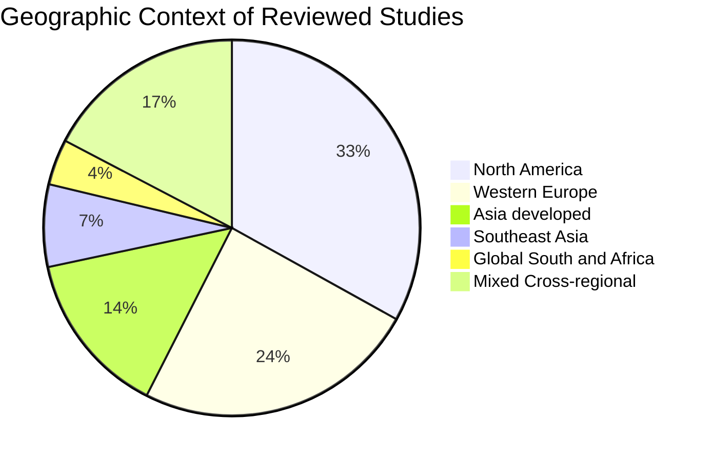

---

### Figure 1.5 — Research Gap Map: Where SkillLink GH Sits

> *Positioning of key research areas by literature coverage vs relevance to SkillLink GH. Areas in the bottom-right quadrant (high relevance, low coverage) represent the gap this project addresses.*

| Research Area | Coverage in Literature | Relevance to SkillLink GH | Quadrant |
|---|---|---|---|
| Western gig platforms (Uber, Fiverr) | High | Medium | Well-covered, less relevant |
| AI recommendation systems | High | High | Well-covered, highly relevant |
| Social media trust frameworks | High | Medium-High | Well-covered, relevant |
| Mobile payments in Africa | Medium | High | Moderately covered, highly relevant |
| Informal economy digitalisation | Low | Very High | **Gap area** |
| Artisan platforms in Sub-Saharan Africa | Very Low | Very High | **Core gap — SkillLink GH** |
| Platform governance in Global South | Very Low | High | **Gap area** |

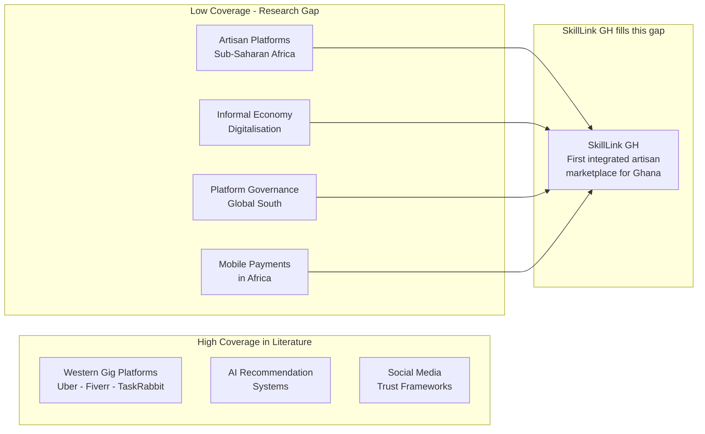

---

## System Architecture Diagrams


### Diagram 1 — High-Level System Architecture

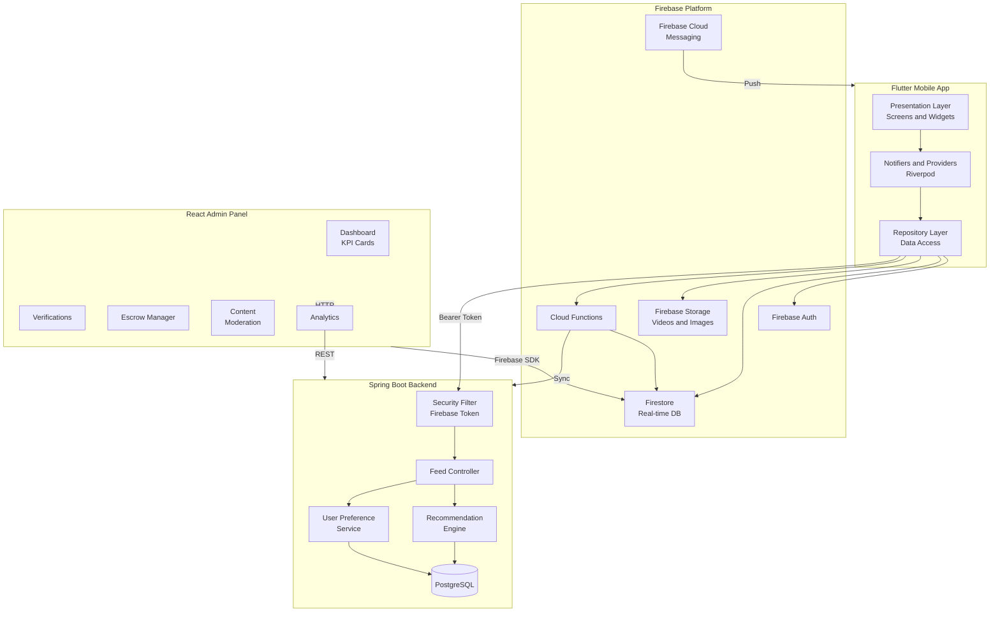


---

### Diagram 2 — DFD Level 0: Context Diagram

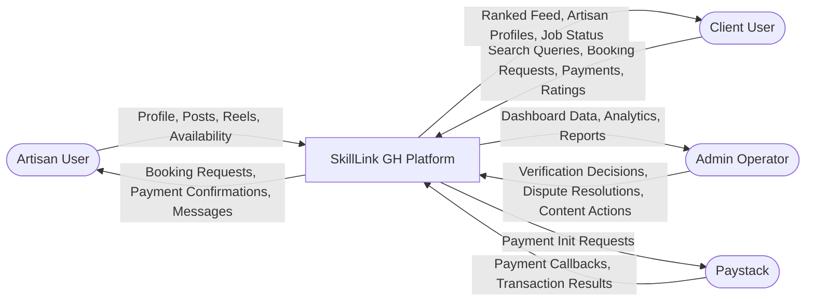

---

### Diagram 3 — DFD Level 1: Functional Processes

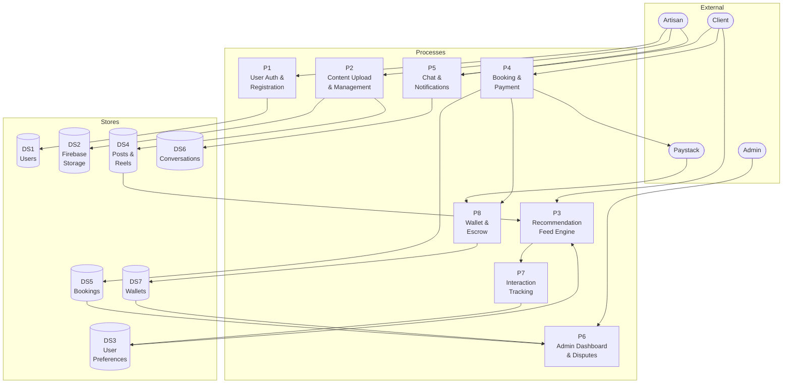

---

### Diagram 4 — UML Component Diagram

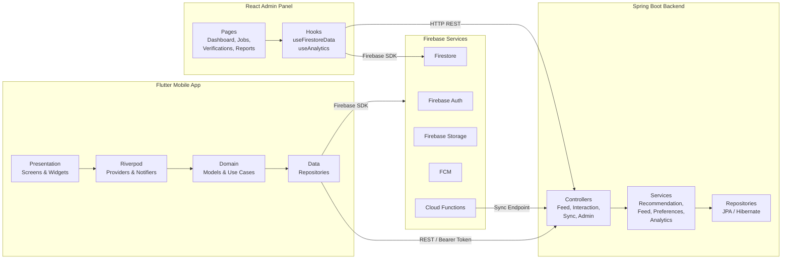


---

### Diagram 5 — Booking Lifecycle Sequence Diagram

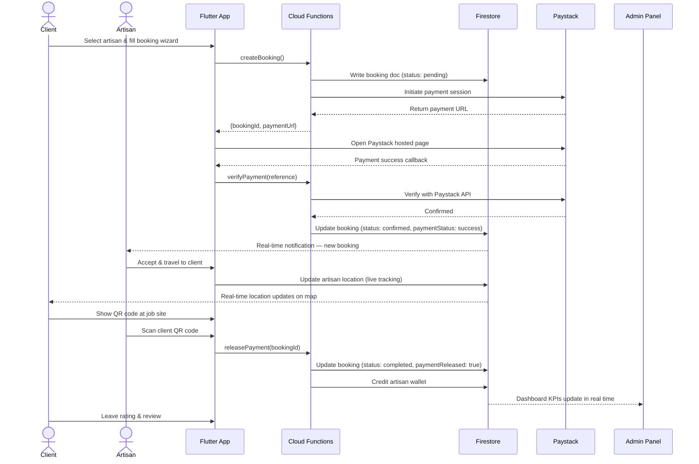

---

### Diagram 6 — Recommendation Engine Scoring Pipeline

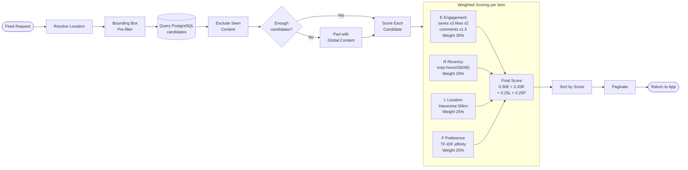


---

### Diagram 7 — User Preference Learning Model

```mermaid
flowchart LR
    subgraph Interactions["User Interactions"]
        I1[BOOK\n+5.0]
        I2[SAVE\n+3.0]
        I3[LIKE\n+2.0]
        I4[COMMENT\n+1.5]
        I5[SHARE\n+2.0]
        I6[VIEW\n+0.2]
        I7[SKIP\n-1.0]
        I8[REPORT\n-3.0]
    end

    subgraph Engine["Preference Update Engine"]
        DELTA[Compute\nWeighted Delta]
        MERGE[Merge into\nCategory Score Map]
        CLAMP[Clamp to ≥ 0]
        NORM[Normalise so\nmax category = 1.0]
        TF[TF-IDF Boost\nniche categories]
    end

    subgraph Storage["user_preferences table"]
        RAW["categoryScores:\nplumbing:0.85,\nelectrical:0.42,\ncarpentry:0.20"]
    end

    subgraph Feed["Next Feed Request"]
        P_SCORE[Category Preference\nScore P ∈ 0–1]
    end

    Interactions --> DELTA --> MERGE --> CLAMP --> NORM --> TF --> RAW
    RAW --> P_SCORE
```

---

### Diagram 8 — Verification Workflow State Machine

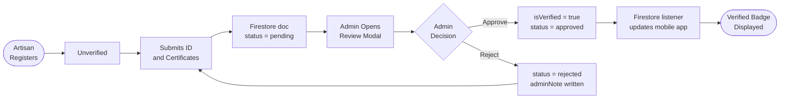

---

### Diagram 9 — Escrow Payment Flow

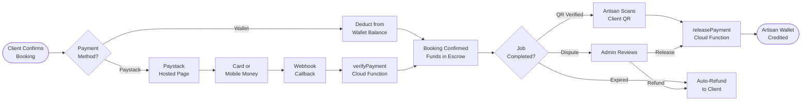


---

### Diagram 10 — Authentication & Onboarding Flow

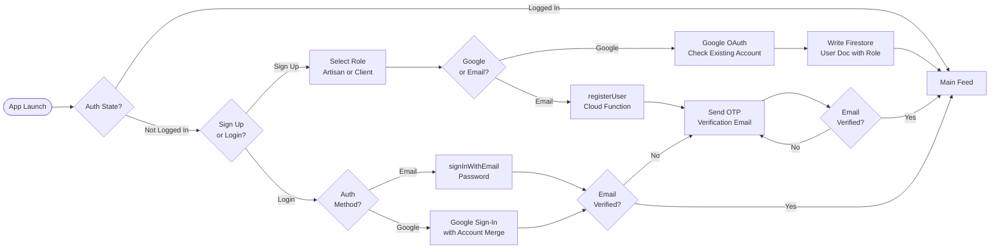

---

### Diagram 11 — Real-Time Chat Architecture

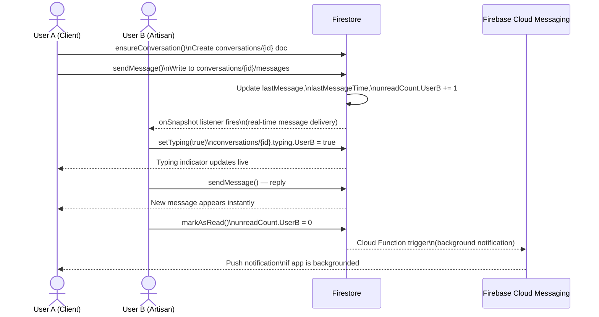

---

### Diagram 12 — PostgreSQL Data Model (Entity Relationship)

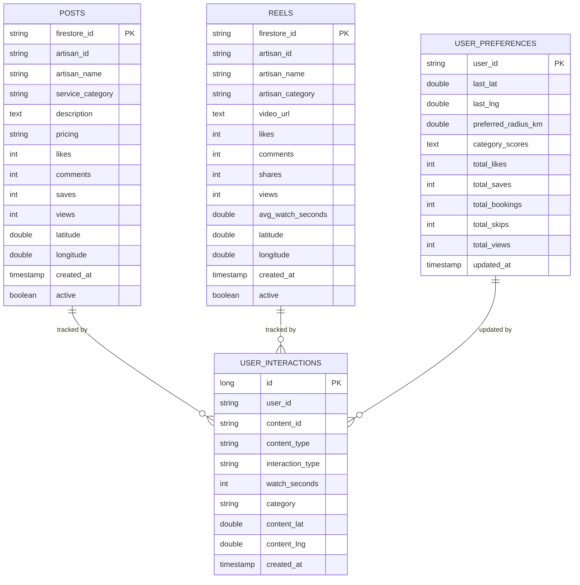


---

### Diagram 13 — Firestore Collections Data Model

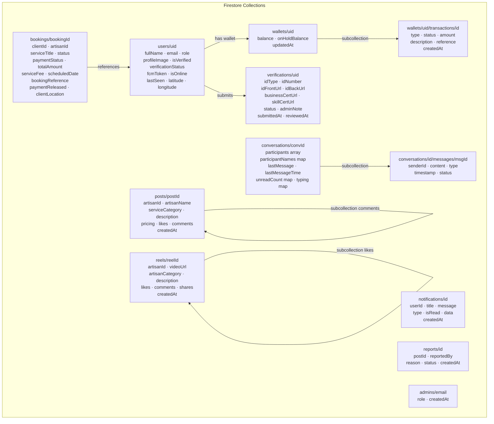

---

### Diagram 14 — Admin Panel Operations Flow

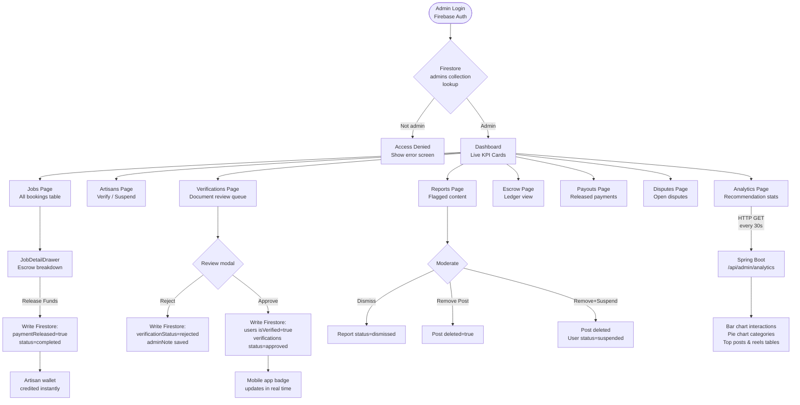


---

### Diagram 15 — Recommendation Engine Analytics Data Flow

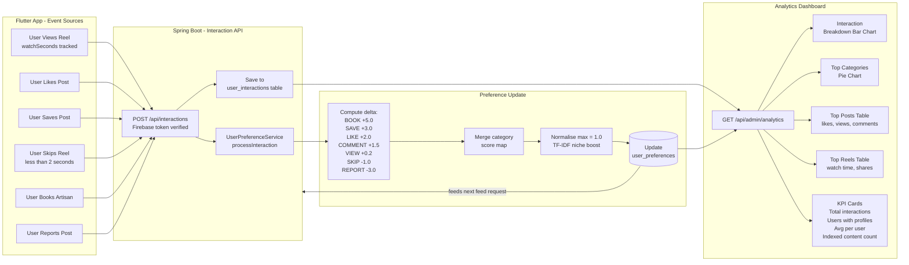

---

### Diagram 16 — Flutter Clean Architecture Layers

```mermaid
graph TB
    subgraph Presentation["Presentation Layer"]
        S1[PostsHomepage]
        S2[ReelsScreen]
        S3[ServiceBookingScreen]
        S4[BookingTrackingScreen]
        S5[WalletScreen]
        S6[ArtisanProfileScreen]
        S7[SearchAndDiscoveryScreen]
        S8[InAppMessaging]
        S9[VerificationScreen]
    end

    subgraph StateLayer["State Management - Riverpod"]
        N1[ReelsNotifier]
        N2[BookingNotifier]
        N3[WalletNotifier]
        N4[ProfileNotifier]
        N5[CommentsNotifier]
    end

    subgraph Domain["Domain Layer"]
        M1[BookingModel]
        M2[PostModel]
        M3[ReelModel]
        M4[WalletTransaction]
        M5[NotificationModel]
        M6[UserModel]
    end

    subgraph Data["Data Layer - Repositories"]
        R1[BookingRepository]
        R2[PostRepository]
        R3[ReelsRepository]
        R4[WalletRepository]
        R5[ChatRepository]
        R6[AuthRepository]
        R7[ArtisanRepository]
        R8[VerificationRepository]
    end

    Presentation --> StateLayer
    StateLayer --> Domain
    StateLayer --> Data
    Data --> Domain
```


---

### Diagram 17 — Reels Feed Infinite Scroll & Like Debounce

```mermaid
sequenceDiagram
    actor User
    participant Screen as ReelsScreen
    participant Notifier as ReelsNotifier
    participant FS as Firestore
    participant BE as Spring Boot Backend

    User->>Screen: Opens Reels tab
    Screen->>Notifier: loadInitialReels()
    Notifier->>FS: Query reels orderBy createdAt DESC limit 10
    Notifier->>FS: Check likes/{uid} for each reel
    FS-->>Notifier: Reels + liked status
    Notifier-->>Screen: AsyncValue.data(reels)
    Screen-->>User: TikTok-style feed renders

    User->>Screen: Watches reel (Stopwatch running)
    User->>Screen: Swipes to next reel
    Screen->>Notifier: trackView(reelId, watchSeconds: 14)
    Notifier->>BE: POST /api/interactions\n{contentType: REEL, type: VIEW, watchSeconds: 14}

    User->>Screen: Double-tap to like
    Screen->>Notifier: toggleLike(reelId)
    Notifier->>Screen: Instant UI update ❤️ +1
    Note over Notifier: 400ms debounce timer starts
    User->>Screen: Taps again (unlike)
    Notifier->>Screen: Instant UI update — unliked
    Note over Notifier: Debounce resets, new timer
    Note over Notifier: Timer fires — net effect: no change
    Note over Notifier: Skip Firestore write (original = final state)

    User->>Screen: Scrolls near end of feed
    Screen->>Notifier: loadMoreReels()
    Notifier->>FS: startAfterDocument(lastReel) limit 5
    FS-->>Notifier: Next 5 reels
    Notifier-->>Screen: Appended to list seamlessly
```

---

### Diagram 18 — Security Architecture

```mermaid
flowchart TD
    subgraph Client["Flutter App and Admin Panel"]
        TOKEN[Firebase ID Token\nJWT expires 1 hour]
        APPCHK[Firebase App Check\nPlay Integrity and DeviceCheck]
    end

    subgraph SpringSec["Spring Boot Security Chain"]
        FILTER[FirebaseTokenFilter\nOncePerRequestFilter]
        VERIFY[FirebaseAuth.verifyIdToken\nFirebase Admin SDK]
        CLAIMS[Extract UID and role\nfrom token claims]
        SECCTX[Populate Spring\nSecurityContext]
        ROLES{Role-based\naccess control}
    end

    subgraph FSRules["Firestore Security Rules"]
        FR1[Only authenticated\nusers write bookings]
        FR2[Only booking parties\nread and update booking]
        FR3[Only artisans\ncreate posts and reels]
        FR4[Only conversation\nparticipants read messages]
        FR5[Users read and write\nown wallet only]
    end

    TOKEN -->|Authorization: Bearer| FILTER
    APPCHK -->|App Check token header| FILTER
    FILTER --> VERIFY
    VERIFY -- Valid --> CLAIMS --> SECCTX --> ROLES
    VERIFY -- Invalid or Expired --> REJECT[HTTP 401 Unauthorized]
    ROLES -- ROLE_ADMIN --> ADMINEP[Admin endpoints /api/admin]
    ROLES -- ROLE_USER --> USEREP[User endpoints /api/feed and /api/interactions]
    Client -->|Firebase SDK requests| FSRules
```


---

### Diagram 19 — Wallet Top-Up Deep Link Flow

```mermaid
sequenceDiagram
    actor User
    participant App as Flutter App
    participant CF as Cloud Functions
    participant PS as Paystack
    participant DL as App Links\n(Deep Link Handler)
    participant FS as Firestore

    User->>App: Tap "Top Up" — enter amount
    App->>CF: initiateWalletTopUp(amount)
    CF->>PS: Create Paystack transaction\ncallback_url = skilllink://wallet?ref=xxx
    PS-->>CF: {authorization_url, reference}
    CF-->>App: {paymentUrl, reference}
    App->>PS: launchUrl(paymentUrl)\nOpens Paystack hosted page
    User->>PS: Completes payment\nCard / MTN / Vodafone
    PS->>App: Redirect to skilllink://wallet?reference=xxx
    App->>DL: uriLinkStream receives deep link
    DL->>App: Extract reference from URI
    App->>CF: verifyWalletTopUp(reference)
    CF->>PS: GET /transaction/verify/{reference}
    PS-->>CF: {status: success, amount: 5000}
    CF->>FS: Update wallets/{uid} balance += amount
    CF->>FS: Write transaction doc\n{type: topUp, status: success}
    FS-->>App: WalletNotifier stream updates\nBalance card refreshes instantly
    App-->>User: ✅ "Wallet topped up successfully!"
```

---

### Diagram 20 — Agile Sprint Timeline

```mermaid
gantt
    title SkillLink GH Agile Development Timeline
    dateFormat  YYYY-MM-DD
    section Phase 1 Requirements and Design
    Stakeholder Interviews            :done, p1a, 2024-09-01, 7d
    Comparative Platform Analysis     :done, p1b, 2024-09-08, 5d
    System Architecture and UML       :done, p1c, 2024-09-13, 7d
    Firebase Setup and DB Schema      :done, p1d, 2024-09-20, 5d

    section Phase 2 Core Infrastructure
    Firebase Auth and User Roles      :done, p2a, 2024-09-25, 7d
    Spring Boot and PostgreSQL        :done, p2b, 2024-09-25, 7d
    React Admin Panel Scaffold        :done, p2c, 2024-10-02, 5d

    section Phase 3A Recommendation Engine
    Scoring Algorithm                 :done, p3a, 2024-10-07, 10d
    Feed Service and Interaction API  :done, p3b, 2024-10-17, 7d
    Preference Learning and Analytics :done, p3c, 2024-10-24, 7d

    section Phase 3B Mobile App Sprints
    Sprint 1 Auth Onboarding Feed     :done, p3d, 2024-10-07, 14d
    Sprint 2 Reels Search Maps        :done, p3e, 2024-10-21, 14d
    Sprint 3 Booking Paystack Wallet  :done, p3f, 2024-11-04, 14d
    Sprint 4 Chat Notifications       :done, p3g, 2024-11-18, 14d

    section Phase 3C Admin Panel
    Dashboard KPIs Jobs Escrow        :done, p3h, 2024-11-04, 10d
    Verifications Reports Disputes    :done, p3i, 2024-11-14, 10d
    Analytics Integration             :done, p3j, 2024-11-24, 7d

    section Phase 4 Testing and Integration
    Backend Unit Tests JUnit5 78pct   :done, p4a, 2024-12-01, 7d
    Flutter Widget Tests 65pct        :done, p4b, 2024-12-01, 7d
    End-to-End Functional Testing     :done, p4c, 2024-12-08, 7d
    Security Testing Firestore Rules  :done, p4d, 2024-12-15, 5d
    Final Documentation               :done, p4e, 2024-12-20, 10d
```

---

## Quick Start

### Prerequisites
- Flutter SDK ^3.10
- Java 17+, Maven 3.8+
- PostgreSQL 14+
- Node.js 18+

### 1. Backend
```bash
cd backend
export DB_USERNAME=postgres
export DB_PASSWORD=your_password
export FIREBASE_PROJECT_ID=skill-link-gh
export FIREBASE_SERVICE_ACCOUNT_PATH=firebase-service-account.json
mvn spring-boot:run
# Runs on http://localhost:8080
# Swagger UI: http://localhost:8080/swagger-ui.html
```

### 2. Flutter App
```bash
cd frontend
flutter pub get
flutter run
```

### 3. Admin Panel
```bash
cd admin_panel
npm install
npm run dev
# Runs on http://localhost:5173
```

---

## How It Works

1. Artisans post services and upload reels (short videos)
2. Clients discover artisans via the TikTok-style feed ranked by the recommendation engine
3. The backend scores every post/reel using engagement, recency, location proximity, and personal category preferences
4. Every interaction (like, save, skip, watch-time, booking) silently updates the user's preference profile
5. Bookings are managed with Paystack payments and an escrow wallet — funds release only on QR code verification
6. The admin panel gives operators full real-time visibility over jobs, artisans, escrow, verifications, and disputes

---

## License

MIT

---

### Diagram 21 — Project Root Structure

```mermaid
graph TD
    ROOT["skill_link_gh - Project Root"]
    ROOT --> FRONTEND["frontend - Flutter Mobile App"]
    ROOT --> BACKEND["backend - Spring Boot Engine"]
    ROOT --> ADMIN["admin_panel - React Dashboard"]
    ROOT --> README["README.md"]
    ROOT --> GITIGNORE[".gitignore"]
```

**frontend/lib structure:**

```mermaid
graph TD
    FLIB["lib/"]
    FLIB --> FMAIN["main.dart - App Entry Point"]
    FLIB --> FPRES["presentation/ - 22 Screens"]
    FLIB --> FDATA["data/ - Repositories"]
    FLIB --> FDOMAIN["domain/ - Models and Use Cases"]
    FLIB --> FPROV["provider/ - Riverpod Providers"]
    FLIB --> FNOTIF["notifier/ - State Notifiers"]
    FLIB --> FSERV["services/ - FCM, Presence, Fare"]
    FLIB --> FROUTES["routes/ - app_routes.dart"]
    FLIB --> FWIDGETS["widgets/ - Shared UI"]
```

**backend/src structure:**

```mermaid
graph TD
    BSRC["com.skilllinkgh.backend"]
    BSRC --> BCTRL["controller/ - Feed, Interaction, Sync, Admin"]
    BSRC --> BSERV["service/ - Recommendation, Feed, Preferences, Analytics"]
    BSRC --> BMODEL["model/ - Post, Reel, UserInteraction, UserPreference"]
    BSRC --> BREPO["repository/ - JPA Repositories"]
    BSRC --> BCONF["config/ - Firebase, Security, Swagger"]
    BSRC --> BDTO["dto/ - Request and Response DTOs"]
```


---

### Diagram 22 — SkillLink GH Tech Stack Overview

| Layer | Tools | Count |
|---|---|---|
| Mobile Framework | Flutter, Dart | 2 |
| State Management | Riverpod, Provider | 2 |
| Backend Framework | Spring Boot, Java 17, Maven | 3 |
| Database Layer | PostgreSQL, Firestore | 2 |
| Auth and Realtime | Firebase Auth, Firestore, Storage, FCM, App Check | 5 |
| Payment Integration | Paystack | 1 |
| Admin UI Libraries | React, Tailwind, shadcn/ui, Recharts | 4 |
| Dev and Build Tools | Vite, Swagger, Lombok, Docker | 4 |
| Testing Frameworks | JUnit5, Mockito, Flutter Test | 3 |

```mermaid
graph LR
    A[Mobile\n2 tools] --> B[Backend\n3 tools] --> C[Database\n2 tools]
    D[Firebase\n5 services] --> B
    B --> E[Admin Panel\n4 tools]
    F[Payments\nPaystack] --> B
```

---

### Diagram 23 — Detailed Tech Stack Breakdown (Per Layer)

```mermaid
graph TB
    subgraph Mobile["Mobile Layer - Flutter and Dart"]
        M1[Flutter 3.10 - Cross-platform UI]
        M2[Riverpod 3.0 - State Management]
        M3[Dio 5.4 - HTTP Client]
        M4[Firebase SDK - Auth, Firestore, Storage, FCM]
        M5[Google Maps - Location and Tracking]
        M6[Paystack Plus - Payment Gateway]
        M7[Video Compress - Reel Optimization]
        M8[App Links - Deep Link Handler]
    end

    subgraph BackendLayer["Backend Layer - Spring Boot and Java 17"]
        B1[Spring Boot 3.2.5 - REST API]
        B2[Spring Security - Firebase Token Filter]
        B3[JPA and Hibernate - ORM]
        B4[PostgreSQL 14 - Scoring Database]
        B5[Firebase Admin SDK - Token Verification]
        B6[SpringDoc Swagger - API Docs]
        B7[Maven 3.8 - Build Tool]
        B8[Lombok - Boilerplate Reduction]
    end

    subgraph AdminLayer["Admin Layer - React and TypeScript"]
        A1[React 18.3 - UI Framework]
        A2[TypeScript 5.8 - Type Safety]
        A3[Vite 5 - Build Tool]
        A4[Tailwind CSS - Utility Styling]
        A5[shadcn/ui - Component Library]
        A6[TanStack Query - Data Fetching]
        A7[Recharts - Analytics Charts]
        A8[Framer Motion - Animations]
    end

    subgraph FirebaseLayer["Firebase Platform"]
        F1[Firebase Auth - Identity and JWT]
        F2[Firestore - Real-time NoSQL DB]
        F3[Firebase Storage - Videos and Images]
        F4[Cloud Functions - Serverless Logic]
        F5[Firebase Messaging - Push Notifications]
        F6[Firebase App Check - Fraud Prevention]
    end

    Mobile -->|Bearer Token REST API| BackendLayer
    Mobile -->|Firebase SDK| FirebaseLayer
    AdminLayer -->|Firebase JS SDK| FirebaseLayer
    AdminLayer -->|HTTP REST| BackendLayer
    FirebaseLayer -->|Cloud Function Sync| BackendLayer
```

---

### Diagram 24 — Deployment Architecture

```mermaid
graph TB
    subgraph Devices["User Devices"]
        AND[Android Device - Flutter APK]
        IOS[iOS Device - Flutter IPA]
        BROWSER[Browser - Admin Panel]
    end

    subgraph CloudFirebase["Firebase Cloud"]
        FAUTH2[Firebase Auth]
        FSTORE[Firestore]
        FSTORAGE[Firebase Storage]
        FFCM2[FCM Push Notifications]
        FCF[Cloud Functions - Node.js 18]
        FAPPCHK[App Check]
    end

    subgraph BackendDeploy["Backend Server"]
        SPRING[Spring Boot JAR - Port 8080]
        PG2[PostgreSQL 14 - Port 5432]
        SPRING --> PG2
    end

    subgraph PaystackSvc["Paystack"]
        PSAPI[Paystack API]
        PSWH[Webhook Callbacks]
    end

    AND -->|HTTPS REST| SPRING
    IOS -->|HTTPS REST| SPRING
    AND -->|Firebase SDK| CloudFirebase
    IOS -->|Firebase SDK| CloudFirebase
    BROWSER -->|Firebase SDK| FSTORE
    BROWSER -->|HTTP GET| SPRING
    FCF -->|HTTPS POST /api/sync| SPRING
    FCF -->|Read and Write| FSTORE
    AND -->|HTTPS| PSAPI
    IOS -->|HTTPS| PSAPI
    PSAPI --> PSWH --> FCF
    FAPPCHK -->|Validates| AND
    FAPPCHK -->|Validates| IOS
```

---

## Production Deployment

### Overview

The SkillLink GH platform is deployed across multiple environments with zero-downtime deployment strategies:

| Component | Environment | URL | Status |
|---|---|---|---|
| **Web App** | Firebase Hosting | https://skilllink-gh-web.web.app | ✅ Live |
| **Admin Panel** | Vercel | https://skilllink-admin.vercel.app | ✅ Live |
| **Backend API** | AWS EC2/Lightsail | https://100-60-0-32.sslip.io | ✅ Live |
| **Database** | Self-hosted PostgreSQL | localhost:5432 (on EC2) | ✅ Live |
| **Cloud Functions** | Firebase Functions | us-central1 | ✅ Live |
| **Firebase Services** | Firebase Cloud | — | ✅ Live |

---

### Deployment Architecture Summary

```
┌─────────────────┐
│  User Devices   │
│  Android / iOS  │
│     Web App     │
└────────┬────────┘
         │
         ├──────────────────┐
         │                  │
    ┌────▼─────┐     ┌──────▼──────┐
    │ Firebase │     │   AWS EC2   │
    │ Services │     │ Spring Boot │
    │ Hosting  │     │  Backend    │
    │ Auth     │     │ PostgreSQL  │
    │ Firestore│     └─────────────┘
    │ Storage  │
    │ Functions│
    └──────────┘
```

---

### 1. Web App Deployment (Flutter Web)

**Platform**: Firebase Hosting  
**Build Tool**: Flutter SDK  
**Deployment Method**: Firebase CLI

#### Deployment Steps

```bash
# Navigate to frontend directory
cd frontend

# Clean previous builds
flutter clean

# Install dependencies
flutter pub get

# Build production web app
flutter build web --release

# Copy build to deployment directory
xcopy "build\web\*.*" "..\skilllink_gh_web\" /E /I /Y /Q

# Deploy to Firebase Hosting
firebase deploy --only hosting:webapp
```

#### Build Optimizations

- **Font tree-shaking**: MaterialIcons reduced by 83.2%, FontAwesome by 99.2%
- **Code splitting**: Deferred loading for non-critical routes
- **Asset optimization**: Images compressed and cached
- **Service Worker**: Offline-first PWA capabilities

#### Deployment Stats (July 2026)

- **Files deployed**: 309 files
- **Build time**: ~351 seconds
- **Deploy time**: ~15 seconds
- **CDN edge locations**: Global (Firebase CDN)
- **SSL/TLS**: Automatic (Let's Encrypt)

---

### 2. Mobile App Deployment (Android)

**Platform**: Google Play Console  
**Build Tool**: Flutter SDK  
**Distribution**: Split APKs by ABI

#### Build Commands

```bash
# Navigate to frontend directory
cd frontend

# Clean build
flutter clean && flutter pub get

# Build release APKs
flutter build apk --release --split-per-abi

# Output:
# - app-armeabi-v7a-release.apk  (32-bit ARM)
# - app-arm64-v8a-release.apk    (64-bit ARM)
# - app-x86_64-release.apk       (64-bit Intel)
```

#### APK Details

| ABI | Size | Target Devices |
|---|---|---|
| arm64-v8a | ~45 MB | Modern Android devices (64-bit) |
| armeabi-v7a | ~42 MB | Older Android devices (32-bit) |
| x86_64 | ~48 MB | Emulators and Intel devices |

#### Google Play Console Upload

1. **Internal Testing** → Upload and test with team
2. **Closed Testing** → Beta testers (50-100 users)
3. **Open Testing** → Public beta (optional)
4. **Production** → Live release with staged rollout (20% → 50% → 100%)

---

### 3. Admin Panel Deployment (React/Vite)

**Platform**: Vercel  
**Build Tool**: Vite  
**Deployment Method**: Git push (auto-deploy)

#### Auto-Deployment Pipeline

```
Git Push → GitHub → Vercel Webhook → Build → Deploy
```

#### Build Configuration (vercel.json)

```json
{
  "buildCommand": "npm run build",
  "outputDirectory": "dist",
  "framework": "vite",
  "installCommand": "npm install"
}
```

#### Environment Variables (Vercel Dashboard)

```
VITE_FIREBASE_API_KEY=...
VITE_FIREBASE_AUTH_DOMAIN=skill-link-gh.firebaseapp.com
VITE_FIREBASE_PROJECT_ID=skill-link-gh
VITE_FIREBASE_STORAGE_BUCKET=skill-link-gh.firebasestorage.app
VITE_FIREBASE_MESSAGING_SENDER_ID=...
VITE_FIREBASE_APP_ID=...
```

---

### 4. Backend API Deployment (Spring Boot on AWS)

**Platform**: AWS EC2 (Ubuntu 22.04 LTS) / AWS Lightsail  
**Runtime**: Java 17, Embedded Tomcat  
**Database**: PostgreSQL 14 (co-located on same instance)  
**Deployment Method**: Manual (systemd service)

#### Server Configuration

**Instance**: `100.60.0.32` (AWS EC2/Lightsail)  
**Domain**: `https://100-60-0-32.sslip.io` (DNS wildcard service)  
**Ports**:
- 8080: Spring Boot API
- 5432: PostgreSQL (localhost only)
- 443: HTTPS (reverse proxy via sslip.io)

#### Deployment Process

```bash
# 1. Build JAR locally
cd backend
./mvnw clean package -DskipTests

# 2. Transfer to AWS server
scp target/skilllink-backend-1.0.0.jar ubuntu@100.60.0.32:/opt/skilllink-backend/app.jar

# 3. SSH into server
ssh ubuntu@100.60.0.32

# 4. Restart Spring Boot service
sudo systemctl restart skilllink-backend
sudo systemctl status skilllink-backend

# 5. Verify deployment
curl http://localhost:8080/api/health
```

#### Systemd Service Configuration

File: `/etc/systemd/system/skilllink-backend.service`

```ini
[Unit]
Description=SkillLink Backend API
After=network.target postgresql.service

[Service]
Type=simple
User=ubuntu
WorkingDirectory=/opt/skilllink-backend
ExecStart=/usr/bin/java -jar /opt/skilllink-backend/app.jar
Restart=on-failure
RestartSec=10

Environment="SPRING_PROFILES_ACTIVE=production"
Environment="SERVER_PORT=8080"

[Install]
WantedBy=multi-user.target
```

#### PostgreSQL Configuration

- **Version**: PostgreSQL 14
- **Listen address**: localhost only (security)
- **Database**: `skilllink_db`
- **Connection pooling**: HikariCP (max 20 connections)
- **Backups**: Daily automated backups to S3 (to be implemented)

---

### 5. Firebase Cloud Functions Deployment

**Runtime**: Node.js 18  
**Region**: us-central1  
**Deployment Method**: Firebase CLI

#### Deploy All Functions

```bash
cd frontend/functions

# Install dependencies
npm install

# Deploy all functions
firebase deploy --only functions
```

#### Deployed Functions (29 total)

**Authentication & User Management**:
- `registerUser` - New user onboarding
- `syncUserProfile` - Sync Firestore ↔ PostgreSQL

**Booking & Payments**:
- `createBooking` - Initialize booking with Paystack
- `verifyPayment` - Verify Paystack webhook
- `updateBookingStatus` - Artisan status updates
- `releasePayment` - Escrow release to artisan wallet

**Wallet Operations**:
- `initiateWalletTopUp` - Paystack top-up
- `verifyWalletTopUp` - Verify top-up payment
- `handleWalletWithdrawal` - Request withdrawal

**Content Management**:
- `onPostCreated` - Sync new post to PostgreSQL
- `onPostDeleted` - Remove from PostgreSQL
- `onReelCreated` - Sync new reel to PostgreSQL
- `onReelDeleted` - Remove from PostgreSQL
- `cleanupVideos` - Delete orphaned Storage files

**Notifications**:
- `sendBookingNotification` - FCM push for bookings
- `sendChatNotification` - FCM push for messages
- `sendPaymentNotification` - FCM push for payments

**Analytics & Maintenance**:
- `distanceMatrixCalculation` - Precompute distances
- `backfillUserPreferences` - Migrate user data
- `backfillOnlineStatus` - Initialize online status

---

### 6. Firestore Rules & Indexes Deployment

#### Deploy Security Rules

```bash
cd frontend

# Deploy Firestore rules
firebase deploy --only firestore:rules

# Deploy Storage rules
firebase deploy --only storage
```

#### Firestore Rules Summary

```javascript
// Example: Bookings collection
match /bookings/{bookingId} {
  // Only authenticated users can create bookings
  allow create: if request.auth != null 
                && request.resource.data.clientId == request.auth.uid;
  
  // Only booking parties can read and update
  allow read, update: if request.auth != null 
                      && (resource.data.clientId == request.auth.uid
                          || resource.data.artisanId == request.auth.uid);
}
```

#### Deploy Firestore Indexes

Indexes are automatically created from `firestore.indexes.json`:

```bash
firebase deploy --only firestore:indexes
```

---

### Deployment Checklist

#### Pre-Deployment

- [ ] Run all unit tests: `npm test`, `flutter test`, `mvn test`
- [ ] Check for breaking changes in dependencies
- [ ] Update environment variables if changed
- [ ] Review Firestore security rules for new features
- [ ] Backup production database (PostgreSQL)
- [ ] Verify Cloud Functions budget and quotas

#### Web App Deployment

- [ ] `flutter build web --release`
- [ ] Copy build to `skilllink_gh_web/`
- [ ] `firebase deploy --only hosting:webapp`
- [ ] Verify: https://skilllink-gh-web.web.app
- [ ] Test critical user flows (login, booking, payment)
- [ ] Clear CDN cache if needed

#### Mobile App Deployment

- [ ] Update version in `pubspec.yaml`
- [ ] `flutter build apk --release --split-per-abi`
- [ ] Test APKs on physical devices (arm64-v8a, armeabi-v7a)
- [ ] Upload to Google Play Console (Internal Testing)
- [ ] Verify App Signing and Release Management
- [ ] Promote to Production with staged rollout

#### Backend API Deployment

- [ ] `./mvnw clean package -DskipTests`
- [ ] SCP JAR to AWS server
- [ ] SSH and restart service: `sudo systemctl restart skilllink-backend`
- [ ] Check logs: `sudo journalctl -u skilllink-backend -f`
- [ ] Verify health endpoint: `curl https://100-60-0-32.sslip.io/api/health`
- [ ] Run smoke tests (create post, fetch feed, track interaction)

#### Cloud Functions Deployment

- [ ] `cd frontend/functions && npm install`
- [ ] `firebase deploy --only functions`
- [ ] Verify functions in Firebase Console → Functions dashboard
- [ ] Check function logs for errors
- [ ] Test critical functions (createBooking, verifyPayment)

#### Post-Deployment

- [ ] Monitor Firebase Console → Analytics for errors
- [ ] Check Sentry / error tracking for crashes
- [ ] Verify database connections and queries
- [ ] Test end-to-end user flows (new user registration → booking → payment → completion)
- [ ] Update deployment documentation with any changes
- [ ] Notify team in Slack / email

---

### Rollback Procedures

#### Web App Rollback

Firebase Hosting keeps version history:

```bash
# List recent deployments
firebase hosting:channel:list

# Rollback to previous version
firebase hosting:rollback
```

Or use Firebase Console → Hosting → Release History → Restore.

#### Mobile App Rollback

Google Play Console:
1. Go to Production → Releases
2. Click "Create new release"
3. Select previous APK version
4. Submit for review (takes 1-2 hours)

#### Backend API Rollback

```bash
# Keep previous JAR as backup
ssh ubuntu@100.60.0.32
cd /opt/skilllink-backend

# Restore previous version
sudo cp app.jar.backup app.jar
sudo systemctl restart skilllink-backend
```

#### Cloud Functions Rollback

Firebase Console → Functions → Select function → Version History → Deploy previous version

---

### Monitoring & Observability

#### Application Monitoring

- **Firebase Crashlytics**: Mobile app crash reports
- **Firebase Performance Monitoring**: App startup time, network requests
- **Spring Boot Actuator**: Backend health checks, metrics (`/actuator/health`, `/actuator/metrics`)
- **Cloud Functions Logs**: Firebase Console → Functions → Logs

#### Infrastructure Monitoring

- **AWS CloudWatch**: EC2 CPU, memory, disk usage
- **PostgreSQL Logs**: `/var/log/postgresql/postgresql-14-main.log`
- **Nginx Logs**: `/var/log/nginx/access.log` (if reverse proxy)

#### Alerting

- **Firebase Alerts**: Set up alerts for high error rates, slow functions
- **AWS SNS**: CPU > 80%, Disk > 90% → Email notification
- **Uptime Monitoring**: UptimeRobot or Pingdom for 100.60.0.32

---

### Continuous Integration / Continuous Deployment (CI/CD)

#### Current Status

⚠️ **Manual Deployment** - No automated CI/CD pipeline exists yet

#### Recommended CI/CD Pipeline (GitHub Actions)

```yaml
# .github/workflows/deploy.yml
name: Deploy Backend to AWS

on:
  push:
    branches: [main]

jobs:
  deploy:
    runs-on: ubuntu-latest
    steps:
      - uses: actions/checkout@v3
      - uses: actions/setup-java@v3
        with:
          java-version: '17'
      - run: ./mvnw clean package -DskipTests
      - uses: appleboy/scp-action@v0.1.4
        with:
          host: ${{ secrets.AWS_HOST }}
          username: ubuntu
          key: ${{ secrets.SSH_PRIVATE_KEY }}
          source: "target/skilllink-backend-1.0.0.jar"
          target: "/opt/skilllink-backend/app.jar"
      - uses: appleboy/ssh-action@v0.1.7
        with:
          host: ${{ secrets.AWS_HOST }}
          username: ubuntu
          key: ${{ secrets.SSH_PRIVATE_KEY }}
          script: sudo systemctl restart skilllink-backend
```

See `AWS_PIPELINE_SETUP_GUIDE.md` for full CI/CD setup instructions.

---

### Deployment Costs (Estimated Monthly)

| Service | Plan | Cost (USD) |
|---|---|---|
| Firebase Hosting | Spark Plan (Free) | $0 |
| Firebase Firestore | Pay-as-you-go | ~$10-20 |
| Firebase Storage | Pay-as-you-go | ~$5-10 |
| Firebase Cloud Functions | Pay-as-you-go | ~$15-25 |
| Firebase FCM | Free (unlimited) | $0 |
| AWS EC2/Lightsail | t2.micro or Lightsail $10 | ~$10-15 |
| Vercel | Hobby Plan | $0 |
| Google Play Console | One-time fee | $25 (once) |
| **Total Estimated** | | **~$40-70/month** |

---

### Security Considerations

#### SSL/TLS Certificates

- **Firebase Hosting**: Automatic SSL (Let's Encrypt)
- **AWS Backend**: Using sslip.io wildcard DNS (HTTPS via proxy)
- **Recommendation**: Set up custom domain with AWS Certificate Manager for production

#### API Security

- **Firebase Auth tokens**: JWT validation on every request
- **Spring Security**: `FirebaseTokenFilter` validates tokens
- **Firestore Rules**: Role-based access control
- **App Check**: Protects against abuse (Play Integrity / DeviceCheck)

#### Secrets Management

- **Environment Variables**: Server-side only (never in client code)
- **Firebase Admin SDK**: Service account JSON on EC2 (permissions: 600)
- **Paystack Secret Key**: Environment variable, not in version control
- **Database Credentials**: Environment variables, localhost-only access

---

## Deployment Status Summary

✅ **Chapters 1-5 Implementation Complete**  
✅ **Web App Deployed**: https://skilllink-gh-web.web.app  
✅ **Admin Panel Deployed**: Vercel (auto-deploy from Git)  
✅ **Backend API Deployed**: AWS EC2 at https://100-60-0-32.sslip.io  
✅ **Cloud Functions Deployed**: 29 functions live on Firebase  
✅ **Mobile App**: Split APKs built and ready for Google Play Console  

**Last Deployment**: July 20, 2026  
**Deployment Method**: Manual (Web, Backend, Functions)  
**Recommended Next Step**: Set up GitHub Actions CI/CD pipeline for automated deployments

---

**End of Deployment Documentation**

