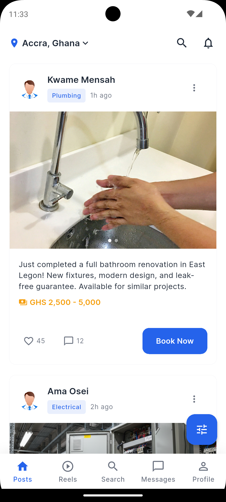
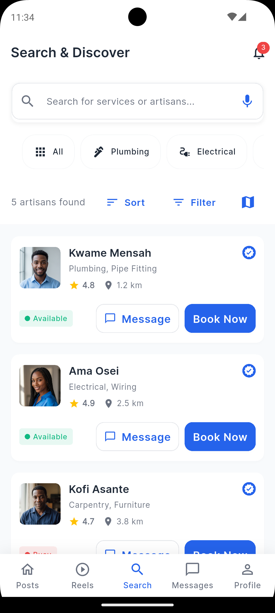
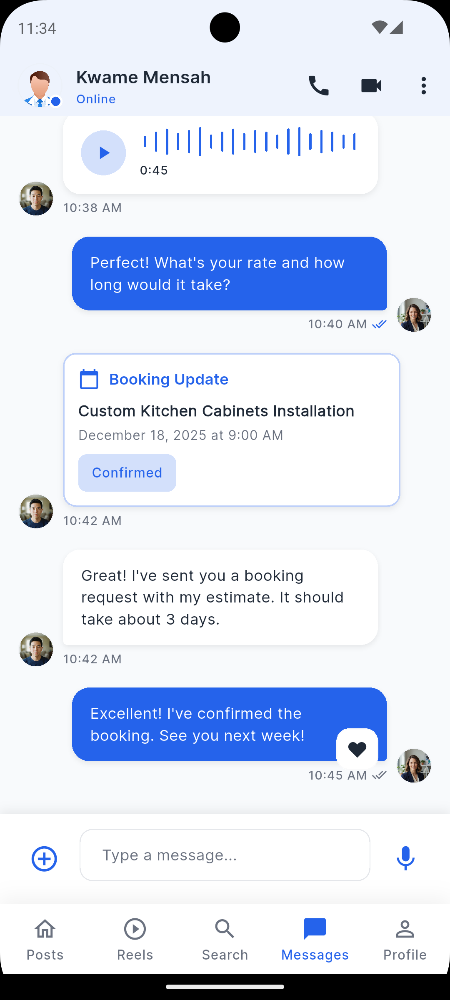
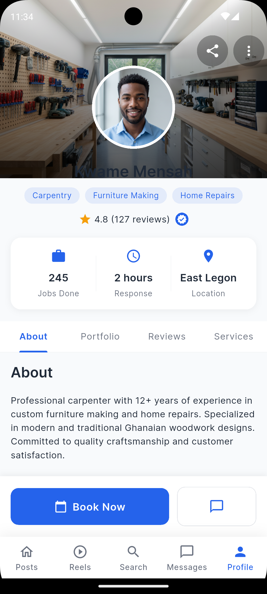
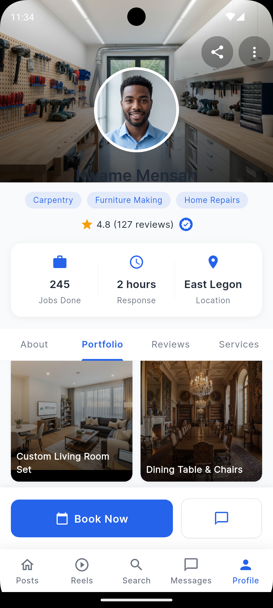
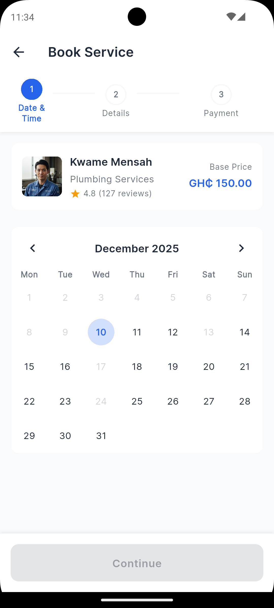

# Skill Link GH – Flutter App

A modern Flutter-based mobile application connecting clients with skilled artisans in Ghana.  
Built for speed, scalability, and modern mobile UX — with a TikTok-style discovery feed, escrow payments, real-time tracking, and in-app messaging.

---

## ✨ Features

- 🔍 **Artisan Search & Discovery** — location-aware, sorted by proximity with map view
- 🏠 **Posts Feed** — personalised feed ranked by recommendation engine (engagement + location + preferences)
- 🎥 **Reels** — TikTok-style short video feed with watch-time tracking and upload
- 💬 **Comments** — nested comments with likes and replies on reels and posts
- 📩 **In-App Messaging** — real-time chat between clients and artisans with typing indicators
- 👤 **Artisan Profiles** — portfolio images, services, reviews, ratings, verification badge
- 📅 **Service Booking** — multi-step flow: date/time picker → service details → location → payment
- 📍 **Real-time Tracking** — live artisan GPS location during active bookings
- 🔐 **QR Code Payment Release** — client scans artisan QR to release escrow payment on job completion
- 💳 **Wallet System** — top-up via Paystack, pay with wallet, on-hold escrow balance, transaction history
- 💰 **Paystack Payments** — card payments with redirect verification
- 🔄 **Auto Refunds** — automatic refund if artisan doesn't accept before booking date
- 🛡️ **Identity Verification** — artisan document verification flow
- 🔔 **OTP Verification** — email OTP on registration
- 🌗 **Light & Dark Theme** — system-aware theming
- 📱 **Responsive UI** — Sizer-based adaptive layout

---

## 🖼️ App Preview

| | | |
|---|---|---|
|  |  |  |
|  |  |  |
|  | | |

---

## 💳 Payment & Escrow Flow

```
Client books service
        ↓
Pays via Paystack card OR wallet balance
        ↓
Payment held in artisan's on-hold balance (escrow)
        ↓
Artisan accepts → travels to client → completes job
        ↓
Client scans artisan's QR code to verify completion
        ↓
On-hold balance released → artisan's spendable wallet
        ↓
If artisan never accepts → auto refund to client wallet
```

---

## 📋 Prerequisites

- Flutter SDK **^3.29.2**
- Dart SDK
- Android Studio or VS Code with Flutter extensions
- Android SDK / Xcode (for iOS)
- Firebase project with `google-services.json` in `android/app/`

---

## 📦 Setup

```bash
flutter pub get
flutter run
```

---

## 🔗 Backend Integration

The app connects to the Spring Boot recommendation backend. Update `_baseUrl` in `lib/services/backend_api_service.dart`:

```dart
static const String _baseUrl = 'http://10.0.2.2:8080';    // Android emulator
// static const String _baseUrl = 'http://localhost:8080'; // iOS simulator
// static const String _baseUrl = 'https://your-api.com';  // Production
```

Falls back to Firestore automatically if the backend is unreachable.

### Interaction tracking (automatic)

| Action | Event sent to backend |
|---|---|
| Like a post/reel | `LIKE` |
| Unlike | `UNLIKE` |
| Save a post | `SAVE` |
| Unsave | `UNSAVE` |
| Report | `REPORT` |
| Watch a reel | `VIEW` + watch seconds |
| Swipe past quickly (<2s) | `SKIP` |

---

## 📁 Project Structure

```
lib/
├── core/                        # Theme, exports, app config
├── data/
│   └── repository/
│       ├── post_repository.dart         # Posts feed (backend-first, Firestore fallback)
│       ├── reels_repositoty.dart        # Reels feed (backend-first, Firestore fallback)
│       ├── booking_repository.dart      # Bookings, location, payment verification
│       ├── artisan_repository.dart      # Artisan discovery with road distance
│       ├── auth_repository.dart         # Firebase Auth + Google Sign-In
│       ├── comments_repository.dart     # Reel comments with likes/replies
│       ├── profile_repository.dart      # User profile, portfolio, reviews, services
│       └── wallet_repository.dart       # Wallet balance, top-up, escrow, refunds
├── domain/
│   └── models/                  # Data models
│       ├── post_model.dart
│       ├── reel_model.dart
│       ├── booking_model.dart
│       ├── comment_model.dart
│       ├── wallet_model.dart
│       └── user_model.dart
├── notifier/                    # StateNotifiers
├── presentation/                # Screens
│   ├── posts_homepage/          # Main feed
│   ├── reels_screen/            # TikTok-style reels
│   ├── posts_comments_detail_screen/
│   ├── artisan_profile_screen/  # Portfolio, reviews, services
│   ├── search_and_discovery_screen/
│   ├── service_booking_screen/  # Multi-step booking
│   ├── booking_management/      # View & manage bookings
│   ├── booking_tracking_screen/ # Live tracking + QR release
│   ├── wallet_screen/           # Balance, top-up, transactions
│   ├── in_app_messaging/        # Real-time chat
│   ├── login_screen/
│   ├── registration_screen/
│   ├── otp_verification_screen/
│   ├── verification_screen/     # Artisan identity verification
│   ├── edit_profile_screen/
│   ├── user_profile_view_screen/
│   └── payment_verification_screen/
├── provider/                    # Riverpod providers
│   ├── backend_provider.dart    # Spring Boot API client singleton
│   ├── post_provider.dart       # Posts feed + interaction tracking
│   ├── reels_provider.dart      # Reels feed + watch-time tracking
│   ├── booking_provider.dart
│   └── wallet_provider.dart
├── routes/                      # AppRoutes
├── services/
│   ├── backend_api_service.dart # Spring Boot HTTP client (Dio + Firebase token)
│   └── presence_service.dart    # Online/offline status
└── main.dart
```

---

## 🧩 Routing

```dart
/posts-homepage          → Main feed
/reels-screen            → TikTok-style reels
/artisan-profile-screen  → Artisan profile
/service-booking-screen  → Book a service
/booking-tracking-screen → Live tracking + QR release
/wallet-screen           → Wallet & payments
/search-and-discovery-screen
/in-app-messaging-screen
/conversations-screen
/payment-verification    → Paystack redirect handler
/user-profile-view       → View any user's profile
/edit-profile-screen
/verification-screen     → Artisan identity verification
```

---

## 🎨 Theming

```dart
final theme = Theme.of(context);
final primary = theme.colorScheme.primary;
```

Supports dark & light mode, custom typography, buttons, cards, input fields.

---

## ⚙️ Build

```bash
# Android APK
flutter build apk --release

# iOS
flutter build ios --release
```

---

## 🛠️ Tech Stack

| Package | Purpose |
|---|---|
| flutter_riverpod | State management |
| firebase_auth | Authentication |
| cloud_firestore | Database + real-time |
| firebase_storage | Video & image storage |
| cloud_functions | Secure server-side logic |
| dio | HTTP client for backend API |
| geolocator + geocoding | Location services |
| google_maps_flutter | Map view |
| video_compress + video_player | Reel upload & playback |
| flutter_paystack_plus | Paystack payments |
| qr_flutter + mobile_scanner | QR code generation & scanning |
| share_plus | Social sharing |
| sizer | Responsive UI |

---

## 📄 License

MIT
